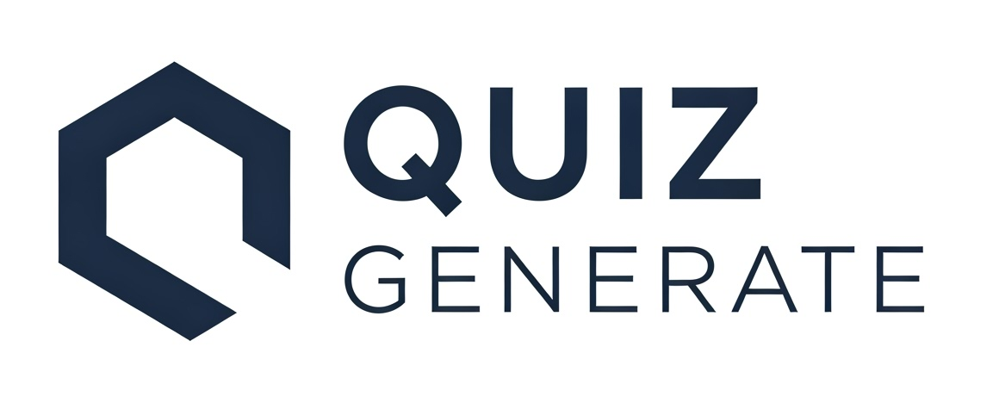

# TFG - QuizzGenerate

### Trabajo Fin de Grado 2024-25

**Grado en Ingeniería Informática**  
**Autor:** Pablo Peris Solano



---

## 📑 Tabla de Contenidos

1. [Descripción](#-descripción)
2. [Características](#-características)
3. [Tecnologías utilizadas](#-tecnologías-utilizadas)
4. [Requisitos previos](#️-requisitos-previos)
5. [Instalación y configuración](#-instalación-y-configuración)
6. [Uso](#-uso)
7. [Estructura del proyecto](#-estructura-del-proyecto)
8. [Contacto](#-contacto)
9. [Licencia](#-licencia)

---

## 📖 Descripción

Este proyecto es una aplicación diseñada para **crear, generar, gestionar y realizar quizzes** de forma online. El objetivo principal es proporcionar una herramienta intuitiva y flexible que permita a los usuarios generar cuestionarios personalizados para diferentes propósitos, como educación, entretenimiento o evaluación.

---

## ✨ Características

- 🔒 **Autenticación segura**: Registro, inicio de sesión y cierre de sesión con soporte para JWT.
- 👤 **Gestión de usuarios**: Configuración de cuenta y datos personales.
- 📝 **Generación de quizzes**: Creación de cuestionarios personalizados con múltiples opciones.
- 🔑 **Restablecimiento de contraseñas**: Envío de correos electrónicos para recuperar contraseñas olvidadas.
- 🖥️ **Interfaz amigable**: Diseño intuitivo para facilitar la experiencia del usuario.
- 🌐 **API RESTful**: Backend desarrollado con Django REST Framework.

---

## 🛠️ Tecnologías utilizadas

### Backend:

- **Django**: Framework principal para el desarrollo del backend.
- **Django REST Framework**: Para la creación de APIs RESTful.
- **Simple JWT**: Manejo de autenticación basada en tokens.
- **SQLite**: Base de datos utilizada en desarrollo (puede cambiarse a PostgreSQL o MySQL en producción).

### Frontend:

- **React**: Librería principal para la interfaz de usuario.
- **Vite**: Herramienta de build y desarrollo ultrarrápida para React.
- **Tailwind CSS**: Para un diseño moderno y responsivo.
- **shadcn/ui**: Componentes de interfaz accesibles y personalizables.
- **Sonner**: Notificaciones toast modernas.
- **Motion**: Animaciones fluidas para React.
- **Lucide React**: Iconos SVG para React.

---

## ⚙️ Requisitos previos

Antes de comenzar, asegúrate de tener instalados los siguientes programas:

- **Python 3.10+**
- **Node.js 16+**
- **npm** o **yarn**
- **Git**

---

## 🚀 Instalación y configuración

### 1. Clonar el repositorio

```bash
git clone https://github.com/tu-usuario/TFG.git
cd TFG
```

### 2. Configurar el backend

```bash
python -m venv backend/.venv
source backend/.venv/bin/activate

pip install -r backend/requirements.txt
```

### 🛠️ Configuración del archivo `.env`

Crea un archivo `.env` en la carpeta `backend/` con las siguientes variables:

### Clave secreta para la seguridad de Django (debe ser única y secreta)

```env
SECRET_KEY="tu_clave_secreta"
```

### Modo de depuración (True para desarrollo, False para producción)

```env
DEBUG="True"
```

### Hosts permitidos (agrega los dominios o IPs que usarás)

```env
ALLOWED_HOSTS="localhost,127.0.0.1"
```

### Configuración del correo electrónico para el restablecimiento de contraseñas

```env
EMAIL_HOST_USER="tu_email@gmail.com"
EMAIL_HOST_PASSWORD="tu_contraseña"
```

## Inicia el backend

```bash
python manage.py migrate
python manage.py runserver
```

### 3. Configurar el frontend

```bash
cd frontend
npm install
npm run dev
```

---

### 📚 Uso

1. Accede al frontend en http://localhost:5173.
2. Regístrate o inicia sesión para comenzar a usar la aplicación.
3. Crea, edita y realiza quizzes desde la interfaz de usuario.

---

### 📂 Estructura del proyecto

```plaintext
TFG/
├── assets/                   # Multimedia del repositorio
├── backend/                  # Código del backend
│   ├── apps/                 # Aplicaciones Django personalizadas
│   │   ├── users/            # Gestión de usuarios (autenticación, perfiles, etc.)
│   │   └── quizzes/          # Lógica relacionada con los quizzes
│   ├── projectTFG/           # Configuración principal de Django
│   ├── manage.py             # Script de gestión de Django
│   └── requirements.txt      # Dependencias del backend
├── frontend/                 # Código del frontend
|   ├── public/               # Multimedia del frontend
│   ├── src/                  # Código fuente del frontend
│   │   ├── app/              # Páginas y rutas principales (Next.js)
│   │   ├── components/       # Componentes reutilizables de React
│   │   ├── config/           # Configuración de constantes generales
│   │   ├── context/          # Contextos globales (autenticación, etc.)
│   │   ├── hooks/            # Hooks personalizados de React para lógica reutilizable
│   │   ├── lib/              # Utilidades y funciones auxiliares
│   │   └── utils/            # Funciones auxiliares y utilidades generales
│   ├── README.md             # README del proyecto Next
│   ├── components.json       # Configuración para la biblioteca shadcn/ui
│   ├── eslint.config.mjs     # Configuración de eslint
│   ├── jsconfig.json         # Configuración de alias para rutas en el proyecto
│   ├── next.config.js        # Configuración de Next.js
│   ├── package-lock.json     # Bloqueo de versiones de dependencias para consistencia
│   ├── package.json          # Configuración del proyecto y lista de dependencias
│   ├── postcss.config.mjs    # Configuración de PostCSS para procesar CSS
│   └── tailwind.config.mjs   # Configuración de Tailwind CSS para personalizar
├── .gitignore                # Archivos y carpetas ignorados por Git
├── LICENSE                   # Licencia del proyecto
└── README.md                 # Documentación del proyecto
```

---

### 📧 Contacto

**Si tienes preguntas, sugerencias o problemas, no dudes en contactarme:**

- **Autor**: Pablo Peris Solano
- **Email**: pabloperissolano@gmail.com

---

### 📝 Licencia

Este proyecto de código abierto está licenciado bajo la licencia MIT. Consulta el archivo [LICENSE](LICENSE) para más detalles.
